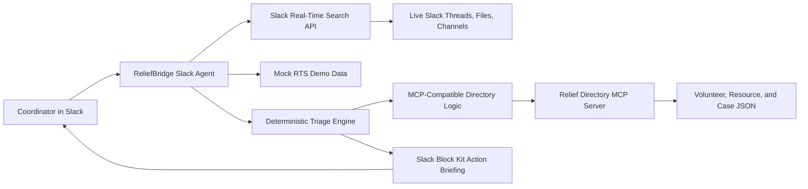

# ReliefBridge Architecture

## Data Flow

1. A coordinator mentions ReliefBridge or sends the app a DM.
2. The agent searches Slack context with Real-Time Search. For a free local demo,
   the same wrapper reads seeded messages from `src/data/demoMessages.json`.
3. The triage engine classifies each result as a need, offer, update, or noise.
4. Needs are scored for urgency and deduplicated.
5. The relief directory logic suggests the best volunteer and resource match.
6. The Slack response is rendered as Block Kit with evidence links and action
   buttons.
7. Claim, resolve, and escalate actions update the local case directory.

## Free-First Design

The MVP does not require paid model APIs, a paid database, or paid deployment.
It is intentionally deterministic for hackathon reliability. A local model can
be added later for summarization, but the core judged behavior works without it.
